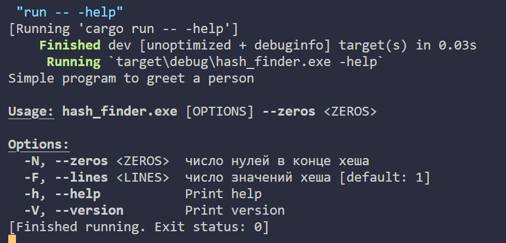
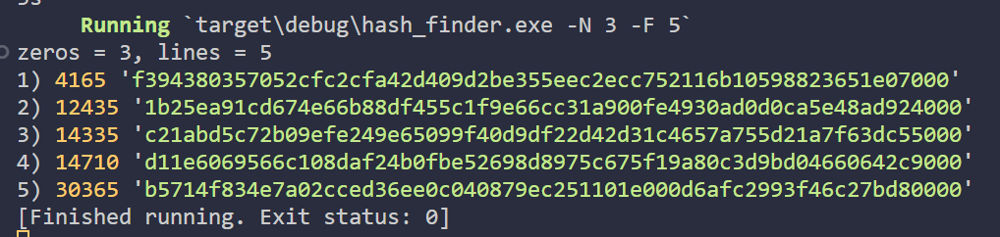

### Задание 3. Поиск хешей.
Пример консольной команды для запуска
```console
cargo run -- -N 3 -F 6
```
`-N` - число нулей в конце строки

`-F` - число строк

`--help` - меню приложения



Пример вывода:


### cargo watch + tests
Отслеживать изменения и при сохранении запускать тесты.
```console
cargo install cargo-watch
cd hash_finder
cargo watch -x "run -- --N 2 -F 6"
```